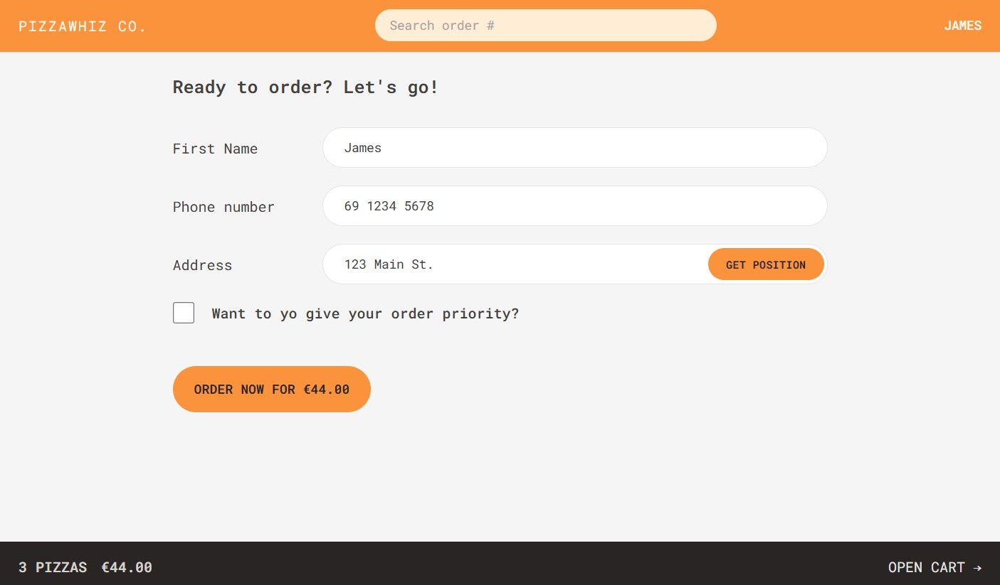

# PizzaWhiz 🍕


**A web-based pizza ordering system that allows users to view the menu, manage their cart, place orders, and track the status of their orders in real time.**

---

## Table of Contents

1. [About the Project](#about-the-project)
2. [Features](#features)
3. [Screenshots](#screenshots)
4. [Getting Started](#getting-started)

- [Prerequisites](#prerequisites)
- [Installation](#installation)

5. [Usage](#usage)
6. [API Documentation](#api-documentation)
7. [License](#license)
8. [Contact](#contact)

---

## About the Project

The **Pizza Order System** is a web-based application designed to provide a seamless pizza ordering experience. Users can browse a menu of pizzas, add items to their cart, adjust item quantities, and place orders. The system integrates a backend built with Node.js, Express, and MongoDB, handling order creation, management, and retrieval, while the frontend is powered by React and Redux for state management.

---

## Features

- **Browse Pizza Menu**: View a variety of pizzas with details like ingredients and prices.
- **Cart Management**: Add items to your cart, increase/decrease quantities, and remove pizzas.
- **Order Creation**: Place an order with customer details, address, and selected pizzas.
- **Order Tracking**: View and manage your orders by their unique ID.
- **Priority Handling**: Mark an order as high-priority for faster delivery.

---

## Screenshots

### Home Page


### Menu Page


### Cart Page


### Create Order Page



### View Order Page


---

## Getting Started

Follow these instructions to get a local copy up and running

### Prerequisites

Make sure you have the following:

- **Node.js** v14+ and **npm** v6+.
- **MongoDB Atlas** account.
- **Render** account (if deploying to Render).

### Installation

1. **Clone the repository**:

   ```bash
   git clone https://github.com/aykinsancakli/pizzawhiz.git
   cd pizzawhiz
   ```

2. **Install dependencies**:

Server dependencies:

```bash
cd server
npm install
```

Client dependencies:

```bash
cd client
npm install
```

3. **Set up environment variables** by creating a `.env` file in the root directory:

In server/.env:

```plaintext
MONGODB_URI=<your-mongodb-atlas-uri>
```

In client/.env:

```plaintext
REACT_APP_API_BASE_URL=http://localhost:5000
```

4. **Start the server and client**:

   In the server folder:

   ```bash
   npm run dev
   ```

   In the client folder:

   ```bash
   npm run dev
   ```

---

## Usage

### 1. **Browse the Menu**

Explore the available pizzas, including their names, ingredients, and prices. You can view the list of pizzas on the menu page.

### 2. **Add to Cart**

Select your desired pizzas from the menu and specify the quantity for each pizza. After selecting, click **"Add to Cart"** to add items to your cart.

### 3. **View Cart**

Navigate to the cart page to see the list of items you've added. Here, you can adjust the quantity of pizzas or remove them from the cart.

### 4. **Proceed to Create Order**

Once you're ready, proceed to the create order page. Enter your customer details (name, phone number, and delivery address) and review your cart before submitting the order.

### 5. **View Order Confirmation**

After submitting the order, you'll receive an order confirmation page with the details of your order, including the estimated delivery time.

### 6. **Order Management**

You can view the status of your orders anytime using the order ID. The status of your order will be updated automatically, such as moving from **preparing** to **delivered**.

---

## API Documentation

### Base URL

The API base URL for backend services is:  
`https://pizzawhiz-server.onrender.com/api`

### Endpoints

#### Menu Routes

- **GET** `/api/menu`  
  Fetches the list of pizzas available for ordering.

  - **Response**: Returns a list of all pizzas with their details such as name, ingredients, price, and image URL.
  - **Example**:
    ```json
    [
      {
        "id": 1,
        "name": "Margherita",
        "unitPrice": 8.99,
        "imageUrl": "https://example.com/margherita.jpg",
        "ingredients": ["Tomato", "Mozzarella", "Basil"],
        "soldOut": false
      },
      {
        "id": 2,
        "name": "Pepperoni",
        "unitPrice": 10.99,
        "imageUrl": "https://example.com/pepperoni.jpg",
        "ingredients": ["Tomato", "Mozzarella", "Pepperoni"],
        "soldOut": false
      }
    ]
    ```

#### Order Routes

- **POST** `/api/order`  
  Create a new order with customer details, cart items, and delivery address.

  - **Request Body**:

    ```json
    {
      "customer": "John Doe",
      "phone": "1234567890",
      "address": "123 Pizza St, Food City",
      "cart": [
        {
          "pizzaId": 1,
          "quantity": 2,
          "unitPrice": 8.99,
          "totalPrice": 17.98
        }
      ],
      "priority": true
    }
    ```

  - **Response**:
    ```json
    {
      "status": "success",
      "data": {
        "id": "order123",
        "customer": "John Doe",
        "address": "123 Pizza St, Food City",
        "orderPrice": 17.98,
        "priorityPrice": 3.6,
        "estimatedDelivery": "2024-11-07T20:30:00.000Z",
        "status": "preparing"
      }
    }
    ```

- **GET** `/api/order/:id`  
  Retrieve the details of a specific order by its ID.

  - **Response**:
    ```json
    {
      "status": "success",
      "data": {
        "id": "order123",
        "customer": "John Doe",
        "phone": "1234567890",
        "address": "123 Pizza St, Food City",
        "cart": [
          {
            "pizzaId": 1,
            "name": "Margherita",
            "quantity": 2,
            "unitPrice": 8.99,
            "totalPrice": 17.98
          }
        ],
        "orderPrice": 17.98,
        "priority": true,
        "priorityPrice": 3.6,
        "estimatedDelivery": "2024-11-07T20:30:00.000Z",
        "status": "preparing"
      }
    }
    ```

- **PATCH** `/api/order/:id`  
  Update the order, such as setting the priority flag to true or false, or any other modification.

  - **Request Body**:

    ```json
    {
      "priority": true
    }
    ```

  - **Response**:
    ```json
    {
      "status": "success",
      "data": {
        "id": "order123",
        "priority": true,
        "priorityPrice": 3.6
      }
    }
    ```

---

## License

Distributed under the MIT License. See `LICENSE` for more information.

---

## Contact

Aykın Sancaklı - [sancakliaykin@gmail.com](mailto:sancakliaykin@gmail.com)  
Project Link: [GitHub Repository](https://github.com/aykinsancakli/pizzawhiz)
